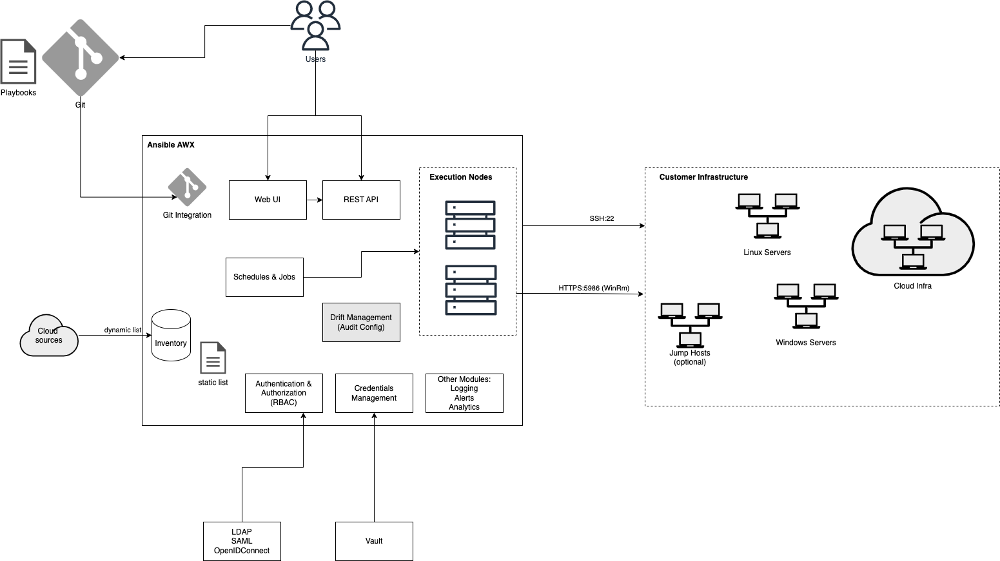

## ICMS
Infrastructure Configuration Management System

## Table of Contents
- [ICMS](#icms)
- [Table of Contents](#table-of-contents)
  - [Solution Overview](#solution-overview)
    - [Internal Components](#internal-components)
    - [External Components](#external-components)
    - [Technology Stack](#technology-stack)
    - [Design Considerations](#design-considerations)
      - [Ansible AWX vs Puppet Enterprise](#ansible-awx-vs-puppet-enterprise)
      - [SaaS vs On-prem Solution](#saas-vs-on-prem-solution)
  - [Communication Mechanisms](#communication-mechanisms)
  - [Security](#security)
  - [Scalability and Extensibility](#scalability-and-extensibility)
  - [Proof-of-Concept](#proof-of-concept)

### Solution Overview

The Infrastructure Configuration Management System is a SaaS solution that provides a unified solution to manage and maintain service configurations across multiple servers for various clients.

Key Features:
- Configuration management
- Audit
- Rollback
- Alerts
- Secure access control
- Scalable
- Extensible

#### Internal Components
- [Ansible AWX](https://github.com/ansible/awx)

(as part of AWX)
- Inventory Management
- Execution Nodes
- Schedules & Jobs
- Identity Providers integration (LDAP/SAML/OpenIdConnect)
- Git Integration
- Credentials Management (Vault Integration)
- Alerts
- Logging
- Web UI
- REST API

(Custom modules)
- Drift Management (Config Audit)

#### External Components
- Git Repositories to store Ansible playbooks
- Cloud Services dynamic inventory sources (if available)
- Identity Providers (LDAP, Okta etc.)
- Hashicorp Vault to store secrets
- Customer Infrastructure (on-prem or cloud)

#### Technology Stack
- Ansible
- Web UI (React, Django)
- REST API (Django)

#### Design Considerations
##### Ansible AWX vs Puppet Enterprise

Feature | Ansible AWX | Puppet Enterprise
--- | --- | ---
Update strategy | Push | Pull
Requires Agent | No | Yes
Drift Management | Requires custom development | Built-in
Scalability | Yes | Yes
Extensibility | Yes. Python Developer |  Yes. Ruby developer
License Cost | Free | per managed node
Adaptability | Easy | not-so-easy

Ansible AWX was chosen because of its:
- Extensibility to add new features
- Adaptability. User and Developer-friendly. Using yaml instead of Puppet DSL
- Agent-less
- License cost

Trade-offs:
- Ansible does not support automatic config corrections when drifts occur. Automatic rollback and Audit on who/when the config changed need custom development.

Mitigations:
- Have scheduled tasks to runs Ansible playbooks periodically, like every 15 minutes. If drifts occur, need to check file information when it changed and corelate logs to identify who changed.

##### SaaS vs On-prem Solution
Feature | SaaS | On-prem
--- | --- | ---
Tech Support |  Easy | Difficult
Firewall issues  |  If infra dont allow inbound connections, need to have jumpbox or switch to Pull strategy | Minimal
Setup / Customer on-boarding | Easy |  Difficult

### Communication Mechanisms
The communication mechanism is mainly using Push strategy
- SSH
- HTTPS (WinRM)
- All communications must be encrypted (TLS)
- For infrastructure that does not allow inbound connections to managed nodes, setup a Jumpbox that can:
  - proxy the ssh command to target nodes (for Linux)
  - port-forward WinRM ports to target nodes (For Windows)

### Security
- Identity Providers can be integrated for Authentication
- 2FA can be integrated with the identity provider
- RBAC control is provided by AWX

### Scalability and Extensibility
- When number of managed nodes increases, scale Execution nodes and/or the AWX server

### Proof-of-Concept
- Pre-requsites: Docker, Ansible,
- Clone https://github.com/ansible/awx
- Commands:
- `make docker-compose-build`
- `make create-ui ui`
- `make docker-compose`

